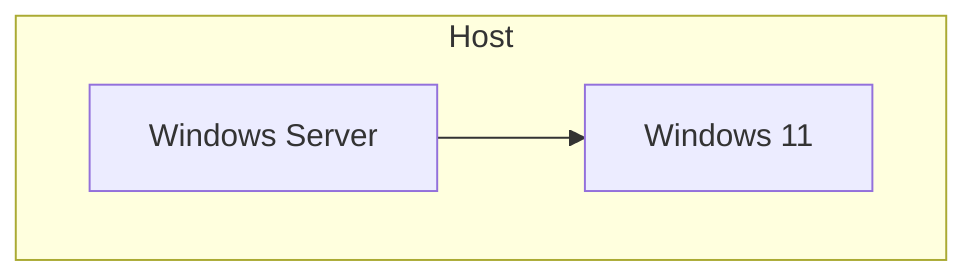

# Teste de Hyper-v

O teste consiste na criação de um ambiente Cliente - Servidor utilizando tecnologia de vitualização Hyper-V da Microsoft tendo a seguinte arquitetura:

## Configuração do Host

Primeiro passo foi a instalação do Hyper-V e a cofiguração do mesmo

## Configuracão do Servidor

Foi criado uma máquina virtual com Windos Server 2012 R2 

### Active Directory

Criação do domínio e configuração de usuarios

## Configuração do Client

Criação de uma maquina virtual windos 11 ingeressa-la ao dominuio criado

